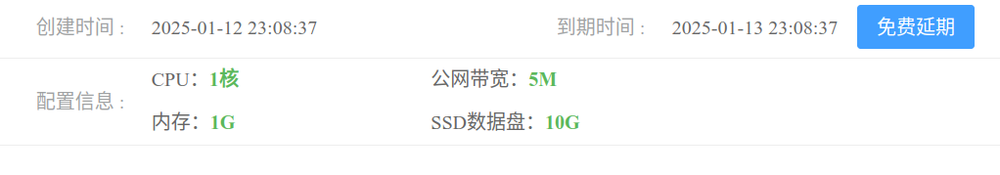
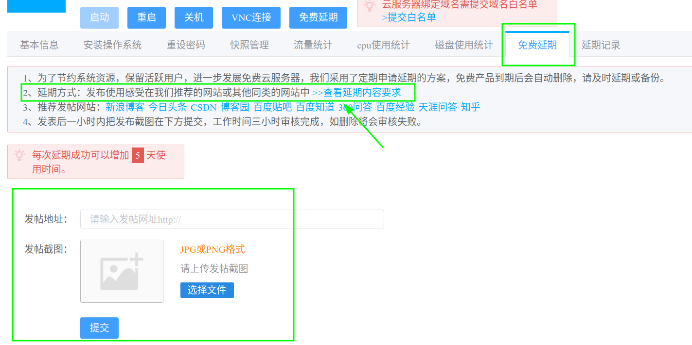

# 免费的云服务器

## 阿贝云
### 简介  
[阿贝云](https://www.abeiyun.com/) 是陕西云游四海网络科技有限公司旗下网络服务品牌，与 2018 年 10 月创建。
### 免费服务器  
它有提供免费服务器服务，性能如下所示：  

### 使用体验
* 申请免费服务器的问题 
    * 注册账户：
        * 需要手机号、身份证号，是的，需要你比较注重个人隐私，那就放弃吧。
    * 实名认证
        * 注册好了之后是无法直接申请服务器的，需要实名认证，这里就需要你的真实姓名，并且认证需要付费(也就是需要充钱，嗯？我不是冲着免费去的吗？)，然后还要绑定微信，emmm。。。就差没要我籍贯啦。
    * 免费延期
    
    这个操作怎么有点眼熟呢？对了，很多电商返红包的套路了，只不过这个不是在他的官网，而是需要在且它平台“发评论”，emmmm,这一点我还是比较反感的。
## 总结
免费的东西不能说没有，但是是很罕见的,大多数情况也及时拿个人隐私当作筹码罢了。相比“个人信息交换”，还要暴漏自己的其他平台(给它免费打广告)，这一点笔者还是不太乐意的。所以，笔者打算放弃它啦。
